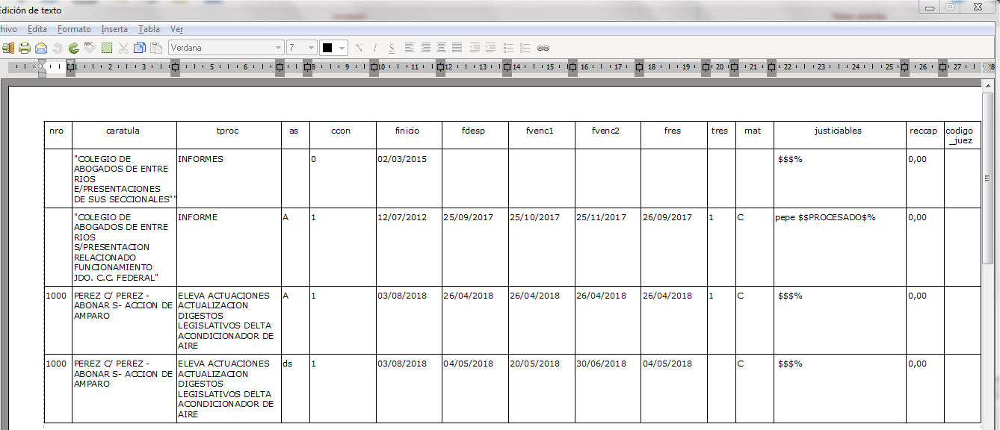

Registros y Listados
========================================================
author: STJER-APGE:Lic. Sebastián Castillo (Director)
date: 2019
autosize: true

Registros y Listados
========================================================
+ dos de los recursos más importantes del sistema de estadístico
+ recursos normalizados y administrados por el APGE

Registros
========================================================
+ contenedores de información
+ funcionan de dos maneras:
  - como "fichas" donde se guardan datos de eventos diferidos en el tiempo (ej. registro de puesta a despacho y resolución), por eso los registros-ficha tienen un ciclo de vida  (se deben actualizar) y se activan y desactivan (0 y 1).
  - como "señaladores" donde se guardan datos de eventos simples (ej. ingreso en cámara de apelación), por eso los registros-señaladores una vez habilitados no se actualizan ni se activan.
+ diseñados por APGE para las operaciones estadísticas aprobadas por el STJER y habilitados por Informática en cada LD.

Registros
========================================================

Registro_ficha ejemplo: causas a despacho y resueltas civiles [link](https://docs.google.com/document/d/1EOJggtPkUTgHQRuQesBuzmEZMoYe2UO3juRUVjiVFNw/edit#heading=h.2jxsxqh)

Registros
========================================================
Errores en el uso de registros:
+ no activar el registro-ficha con 1
+ desactivar el registro-ficha antes de informar datos mediante listado
+ cargar más de dos registros por evento
+ carga de datos no-conforme según campo del registro (campo numérico solo se completa con números)

Registros
========================================================

Recomendacion: Que el alta o actualización de cada registro (sean los Registros de Audiencias como los de Resoluciones) se efectúe en el mismo momento y por la misma persona que registra la novedad. Por ejemplo: el Registro de Audiencia Realizada debería actualizarse por el operador o asistente que se encarga de registrar y producir los documentos de la audiencia, etc. De esta forma se logra mantener un registro actualizado de los datos judiciales con fines estadísticos, permitiendo que la registración se beneficie con la inmediatez del conocimiento y manejo que tiene el operador del legajo o proceso, evitando uno de las causas de mayores problemas y dilaciones en la estadística judicial hasta el momento que ha sido la registración diferida.

Listados
========================================================
+ recolectores de información
+ funcionan recuperando la información almacenada en:
  - registros.
  - campos de datos de Lex_Doctor (ej. carátula, justiciables, etc).
+ estructura de datos predefinida (composición -columnas y orden- y formato -TXT-).
+ diseñados por APGE para las operaciones estadísticas aprobadas por el STJER y habilitados por Informática en cada LD.

Listados
========================================================

Listado ejemplo: 

Listados
========================================================
Errores en el uso de listados:
+ no seleccionar el listado correcto
+ configurar opciones de producción en Lex-Doctor no adecuadas a la información que se quiere extraer (errores en el intervals de fechas)
Problemas en listado:
+ desactualizacion/configuracion

Listados
========================================================
Recomendacion IMPORTANTE: Determinar un responsable de la presentación de los listados de estadística, quien  -junto al secretario- serán los que tendrán acceso a los pre-informes de indicadores calculados como así también al índice de calidad de la información registrada. Con ello, y por intervención del responsable de presentación, el organismo se asegura tener un control efectivo sobre los datos entregados al APGE y el grado de calidad de los mismos.
