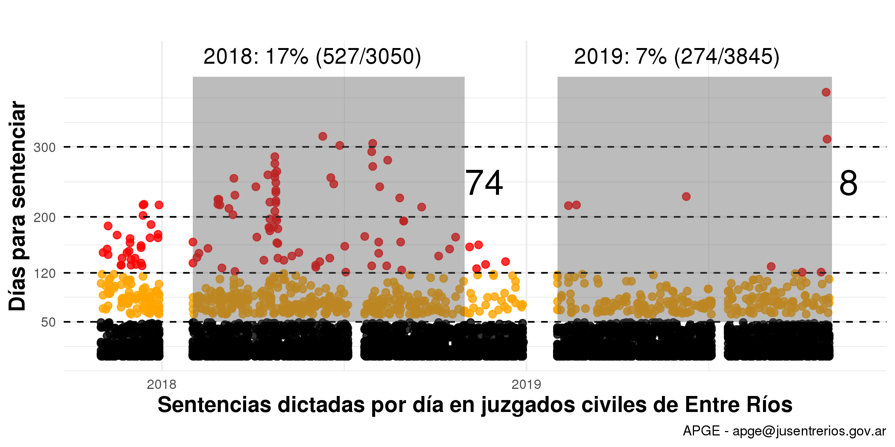

Area de Planificación Gestión y Estadística - APGE
========================================================
width: 1920
height: 1080
author: Lic. Sebastián Castillo - Director
date: 2019
autosize: true

APGE - Productos/Servicios
========================================================

APGE - Historia  
========================================================

APGE - Problema
========================================================

Tecnología de trabajo estadístico: 1982/2016, mas de 30 años!

APGE - Dos Caminos
========================================================

**Fácil**     
+ Sistema estadística y un software de soporte pre-configurado: U$S 500mil por Software Integrado o U$S 109mil por Tableros, ambos privativos con código cerrado    

***

**Difícil**    
+ Sistema estadístico y una herramienta tecnológica **nuevos!**. 

APGE Camino Difícil: Sistema de Estadística Pública Judicial del STJER + JUSTAT 
========================================================

+ [INDEC](https://www.indec.gob.ar/), 2016:Emergencia administrativa Sist.Estadístico Nacional (Dec.55/2016) y revisión metodológica y operativa de todos los indicadores de publicación periódica.
+ [EUROSTAT](https://ec.europa.eu/eurostat), 2016: Aplicación Modelo Genérico Proc. Estadísticos
+ [R, Official Statistics](https://cran.r-project.org/web/views/OfficialStatistics.html), 2013 +: Publicaciones y Herramientas 
+ [GREP-JUFEJUS Argentina](http://www.jufejus.org.ar/index.php/2013-04-29-21-18-54/estadisticas), 2010 +: Código de Buenas Prácticas de las Estadísticas Judiciales

APGE JUSTAT:Tableros de Estadística
========================================================

+ [https://tablero.jusentrerios.gov.ar/](https://tablero.jusentrerios.gov.ar/)   

APGE Resultados 1: Balance Económico (en millones $, 2017-oct2019)
========================================================
incremental: true

APGE - Resultados 2: Política Judicial e Información Estadística
=======================================================
La política de disminución de los tiempos del proceso (Presidencia STJER), la actividad de los órganos judiciales y la disponibilidad de información válida y oportuna actuaron incidiendo en la mejora de la duración de tiempos procesales.     

APGE - Resultado: menos días para dictar sentencia
========================================================
Caso Juzgados Civiles y Comerciales, noviembre 2017

APGE - Resultado: menos días para dictar sentencia
========================================================

========================================================

========================================================

APGE - Próximos Pasos
========================================================

+ Fortalecimiento Institucional:
  - actualización reglamentaria, 
  - integración institucional (eg.PER), 
  - nacionalización (eg.CIPPEC),
  - comunicación pública "amigable",    
+ Fortalecimiento de las Capacidades Estadísticas
  - consolidar *arquitectura estadística judicial crítica*,   
  - mejorar operacionalización teórica (eg. nomenclador resoluciones),       
  - capacitación órganos informantes
+ Desarrollo Tecnológico:
  - integración de Bases Datos    
  - desarrollo de Productos (T y B).

APGE - Próximo Gran Paso? Convenio sobre Inteligencia Artificial 
========================================================

+ Estudio Viabilidad para implementar una línea de investigación en la aplicación de inteligencia artificial 
para análisis de textos legales (UTN,Facultad Paraná, Maestría Minería de Datos)

APGE - Agradecimientos
========================================================
+ STJER
+ Secretaría Superintendencia Nº2 Dr. Esteban Simón

Equipo:   
+ Emilce Leones (operador)
+ Marcos Londero (técnico)
+ Sebastián Castillo (director)

Gracias
Área de Planificación Gestión y Estadística    
Superior Tribunal de Justicia de Entre Ríos    
0343-4209405/410 – ints. 396 y 305    
+ apge@jusentrerios.gov.ar  
+ estadistica@jusentrerios.gov.ar   

APGE Caminando 
========================================================

**Necesidades**     

**Recoleccion & Procesamiento**

***

**Diseño & Construcción**
    

**Publicación**

APGE - Hitos
========================================================

+ **30/05/16 creación APGE (AG 14/16 pto.3)**   
+ 14/06/16 aprobación Plan Modernización [Res.TS Nº234/17](http://www.jusentrerios.gov.ar/estadistica/reglamento-de-estadistica-19-09-17/)
+ 22/08/16 presentación del Reglamento Estadística
+ 01/09/16 presentaciones listados digitales (mail)
+ 07/02/17 APP recolección de listados
+ **26/04/17 aprueba indicadores Sala Civil/prueba piloto**   
+ 01/10/17 implementación provincial civil
+ 21/02/18 aprueba indicadores Sala Trabajo/prueba piloto
+ 01/03/18 implementación provincial laboral
+ 21/05/18 aprueba indicadores Sala Penal/prueba piloto 
+ **01/06/18 Acceso Interno a Tableros** e implementación provincial penal
+ 21/09/18 finalización Plan M y Liberación Datos 
+ **01/03/19 1er.Boletín Mensual Estadística Pública STJER**
+ **30/11/19 Acceso Público Tableros**

APGE - Sistema de Estadística Pública Judicial
========================================================
[Nuevo modelo estadístico (173*38)/18c](http://justat.jusentrerios.gov.ar:8787/files/apge_presentacion/capacitacion/materiales/PAGINAWEB%20-%20Nuevo%20Modelo%20de%20Procesos%20Estad%C3%ADsticos%20.pdf). Integrado por un conjunto de operaciones diseñadas e implementadas por el APGE. Este modelo constituye un sistema coherente de definiciones sustantivas, metodologías, procedimientos y herramientas dirigido a la producción de información de calidad para consulta pública.

APGE - Publicidad 
========================================================
+ [Guías de Estadística](https://drive.google.com/drive/folders/1HjJ8E82mcIVIck4H0giFWwTmOVLbK2NZ)
+ [Configuración Institucional](https://bitbucket.org/apgye/apgyejuserorganization/src/master/)
+ [Procesamiento](https://bitbucket.org/apgye/apgyeoperationsjuser/src/master/R/)

APGE - Productos 
========================================================

Productos: 
+ Boletín Mensual Estadística
+ Tableros de Estadística
+ Informes Ad-Hoc

APGE - Sistema: JUSTAT (en desarrollo)
========================================================

+ [JUSTAT](http://justat.jusentrerios.gov.ar:8787/files/apge_presentacion/capacitacion/materiales/JUSTAT_tecnolog%C3%ADas.png)
+ software libre "R"
+ statistical framework
+ agnóstico BD

APGE - JUSTAT_Módulos
========================================================

- Módulo Presentación (Proceso Recoleccion)
- Módulo Operaciones (Procesamiento)
- Módulo Informes (Analisis-Diseminación)

APGE - JUSTAT_Módulo_Presentación
========================================================

- Presentación de información primaria 
- Acceso a presentaciones realizadas (control, modificación y representación) 
- Informe de presentaciones pendientes
- Reporte de indicadores estadísticos 
- Índice de calidad de datos primarios

APGE - JUSTAT_Módulo_Informes
========================================================
Informe Justicia de Paz: hacia la redistribución de competencia   

+ [Causas_iniciadas_Paz_2018](http://justat.jusentrerios.gov.ar:8787/files/apge_presentacion/capacitacion/materiales/graf_inic_paz_2018.html) 
+ [Causas_iniciadas_Paz1C](http://justat.jusentrerios.gov.ar:8787/files/apge_presentacion/capacitacion/materiales/Inic_1c_xgrupo.html) 
+ [Escenario Redistribucion](http://justat.jusentrerios.gov.ar:8787/files/apge_presentacion/capacitacion/materiales/escenario_redistribucion.html)    

Modelo Parametrizado

APGE - JUSTAT_Módulo_Tableros
========================================================

Tablero

APGE - Equipo
========================================================
+ Emilce Leones (operador)
+ Marcos Londero (técnico)
+ Sebastián Castillo (director)

Gracias

Área de Planificación Gestión y Estadística
Superior Tribunal de Justicia de Entre Ríos
0343-4209405/410 – ints. 396 y 305
+ apge@jusentrerios.gov.ar  
+ estadistica@jusentrerios.gov.ar   
